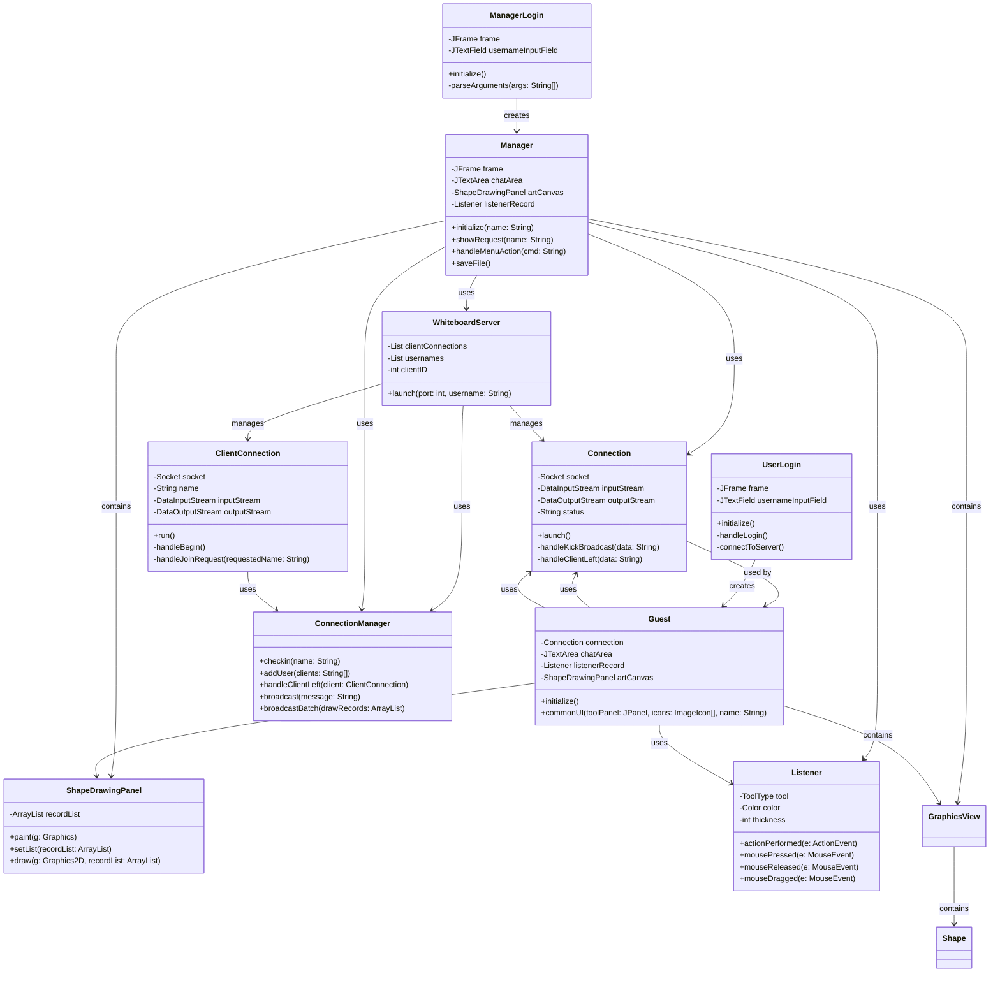
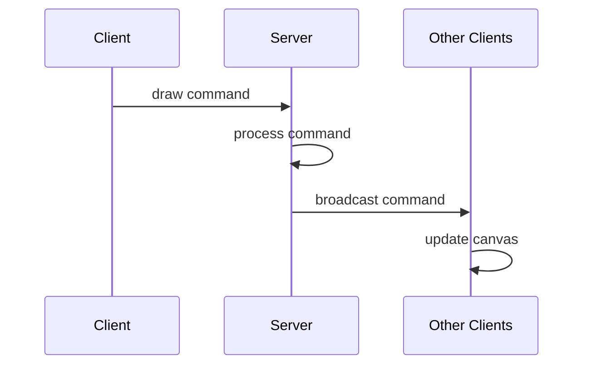
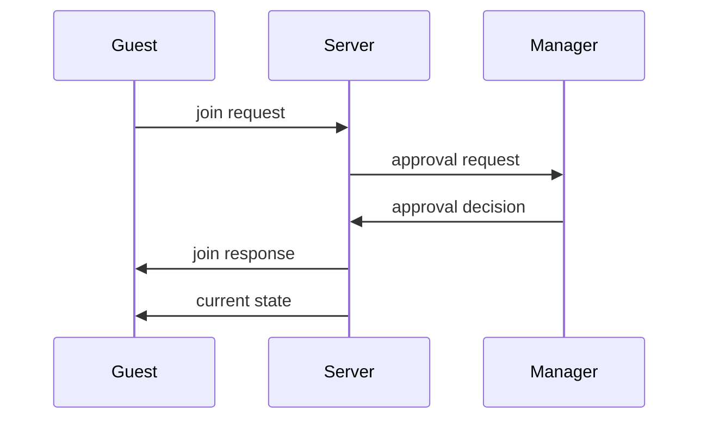

# Distributed Shared Whiteboard System
## Design, Implementation and Analysis Report

### 1. Introduction

#### 1.1 Project Objectives
This project aims to develop a distributed whiteboard system that enables real-time collaborative drawing and communication among multiple users. The system provides a shared canvas where users can draw, chat, and interact in real-time, making it suitable for remote collaboration, brainstorming sessions, and educational purposes.

#### 1.2 Background & Motivation
In today's distributed work environment, collaborative tools have become essential for effective team communication and idea sharing. A shared whiteboard system offers several advantages:
- Real-time visual collaboration
- Immediate feedback and interaction
- Support for both synchronous and asynchronous work
- Enhanced remote team communication

#### 1.3 Challenges Addressed
The development of this system addresses several key challenges in distributed systems:
1. **Real-time Synchronization**
   - Maintaining consistent state across all clients
   - Handling concurrent drawing operations
   - Managing message delivery and ordering

2. **Concurrency Management**
   - Coordinating simultaneous user actions
   - Preventing conflicts in shared resources
   - Ensuring thread safety in user management

3. **Session State Management**
   - User authentication and authorization
   - Session persistence and recovery
   - Privilege control (manager vs. guest roles)

#### 1.4 Technology Stack
- **Programming Language**: Java
- **Network Communication**: TCP Sockets
- **Concurrency**: Java Threads
- **User Interface**: Java Swing
- **Data Structures**: ArrayList, ConcurrentHashMap
- **Development Tools**: Eclipse/IntelliJ IDEA

### 2. System Design & Architecture

#### 2.1 Components of the System

##### 2.1.1 Manager (Server + GUI)
The Manager component serves as both the server and the primary user interface:
- Handles user session management
- Controls file operations
- Manages user permissions
- Coordinates drawing synchronization
- Provides administrative functions (kick-out, approval)

##### 2.1.2 Guest Clients
Guest clients connect to the Manager's server and provide:
- Drawing interface
- Chat functionality
- Real-time updates
- User interaction capabilities

##### 2.1.3 Communication Layer
The communication layer implements:
- TCP socket-based communication
- Thread-per-connection model
- Bi-directional message flow
- Message broadcasting mechanism

##### 2.1.4 Storage Model
The system uses:
- In-memory storage for drawing state
- ConcurrentHashMap for user session management
- ArrayList for drawing command history

#### 2.2 Client-Server Architecture

The system follows a client-server architecture with the following characteristics:

1. **Server Role (Manager)**
   - Initializes the whiteboard session
   - Manages user connections
   - Broadcasts updates to all clients
   - Maintains system state

2. **Client Role (Guests)**
   - Connects to the server
   - Sends drawing commands
   - Receives updates
   - Maintains local state

3. **Communication Flow**
   ```
   Client → Server → Broadcast → All Clients
   ```

### 3. Communication Protocol & Message Format

#### 3.1 Message Types
The system supports various message types:
- `draw`: Drawing commands
- `chat`: Chat messages
- `request`: Join requests
- `feedback`: Join approval/denial
- `kick`: User removal
- `begin`: Session initialization
- `over`: Session termination

#### 3.2 Message Format
Messages follow a simple text-based format:
```
command_type content
```

Examples:
```
draw line 100,100,200,200,red,2
chat Hello everyone!
request username
feedback yes
```

#### 3.3 Broadcast Mechanism
The server implements a broadcast mechanism that:
1. Receives messages from clients
2. Processes the message
3. Broadcasts to all connected clients
4. Updates the server state

### 4. Design Diagrams

#### 4.1 UML Class Diagram


#### 4.2 Sequence Diagrams

##### 4.2.1 Drawing Synchronization Flow


##### 4.2.2 User Join Flow


### 5. Implementation Details

#### 5.1 Communication Protocol Implementation

The communication protocol is implemented using Java's socket programming:

```java
// Server-side connection handling
public class WhiteboardServer {
    public static ConcurrentHashMap<String, ClientConnection> userConnections = new ConcurrentHashMap<>();
    
    protected static void launch(int port, String username) {
        ServerSocket server = new ServerSocket(port);
        while (true) {
            Socket client = server.accept();
            ClientConnection clientConnection = new ClientConnection(client);
            clientConnection.start();
        }
    }
}
```

#### 5.2 Threading and Concurrency Model

The system uses a thread-per-connection model:

```java
public class ClientConnection extends Thread {
    public void run() {
        while (true) {
            String message = inputStream.readUTF();
            processMessage(message);
        }
    }
}
```

#### 5.3 GUI Implementation

The GUI is built using Java Swing:

```java
public class GraphicsView extends JPanel {
    private ArrayList<Shape> shapes;
    
    @Override
    protected void paintComponent(Graphics g) {
        super.paintComponent(g);
        for (Shape shape : shapes) {
            shape.draw((Graphics2D) g);
        }
    }
}
```

### 6. Critical Analysis

#### 6.1 Strengths
1. **Simple and Effective Architecture**
   - Clear separation of concerns
   - Easy to understand and maintain
   - Good scalability for small to medium user groups

2. **Robust Communication**
   - Reliable TCP-based communication
   - Thread-safe message handling
   - Efficient broadcast mechanism

3. **User-Friendly Interface**
   - Intuitive drawing tools
   - Real-time updates
   - Responsive design

#### 6.2 Limitations
1. **Scalability**
   - Limited by thread-per-connection model
   - Potential performance issues with many users
   - No load balancing

2. **State Management**
   - In-memory storage only
   - No persistence between sessions
   - Limited error recovery

3. **Feature Limitations**
   - No undo/redo functionality
   - Limited file format support
   - Basic user management

### 7. Conclusion

#### 7.1 Summary
The distributed whiteboard system successfully implements:
- Real-time collaborative drawing
- User management
- Chat functionality
- File operations
- Session management

#### 7.2 Lessons Learned
1. Importance of thread safety in distributed systems
2. Value of clear communication protocols
3. Balance between simplicity and functionality
4. Need for robust error handling

#### 7.3 Future Improvements
1. **Technical Enhancements**
   - Implement undo/redo functionality
   - Add persistent storage
   - Improve error recovery
   - Add reconnection support

2. **Feature Additions**
   - More drawing tools
   - Enhanced file format support
   - User authentication
   - Session recording

3. **Performance Optimization**
   - Implement connection pooling
   - Add load balancing
   - Optimize message broadcasting
   - Improve state synchronization

### References
1. Java Documentation
2. TCP/IP Protocol Specification
3. Java Swing Documentation
4. Concurrent Programming in Java 