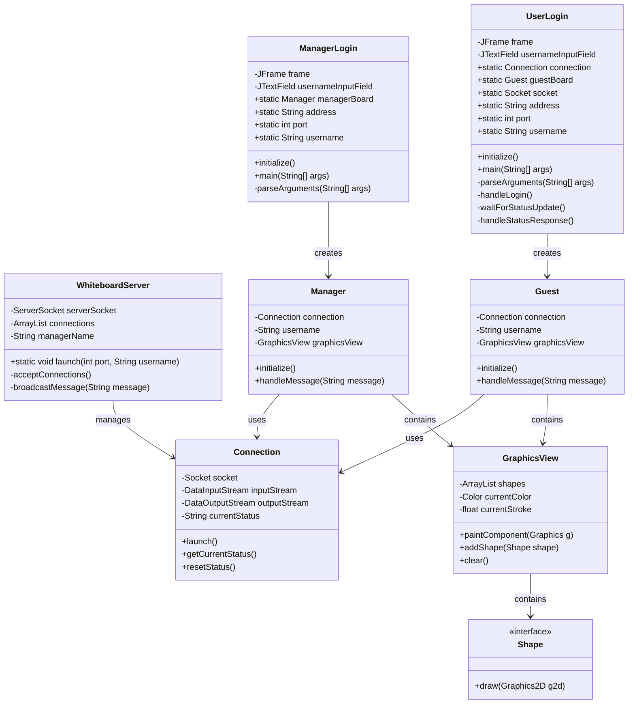
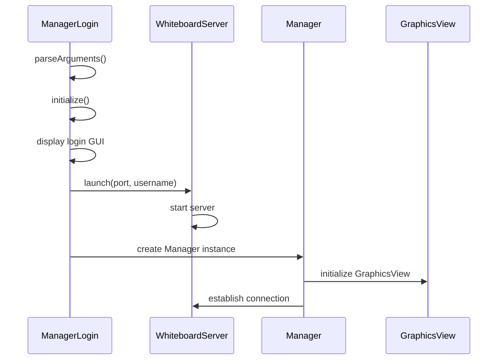
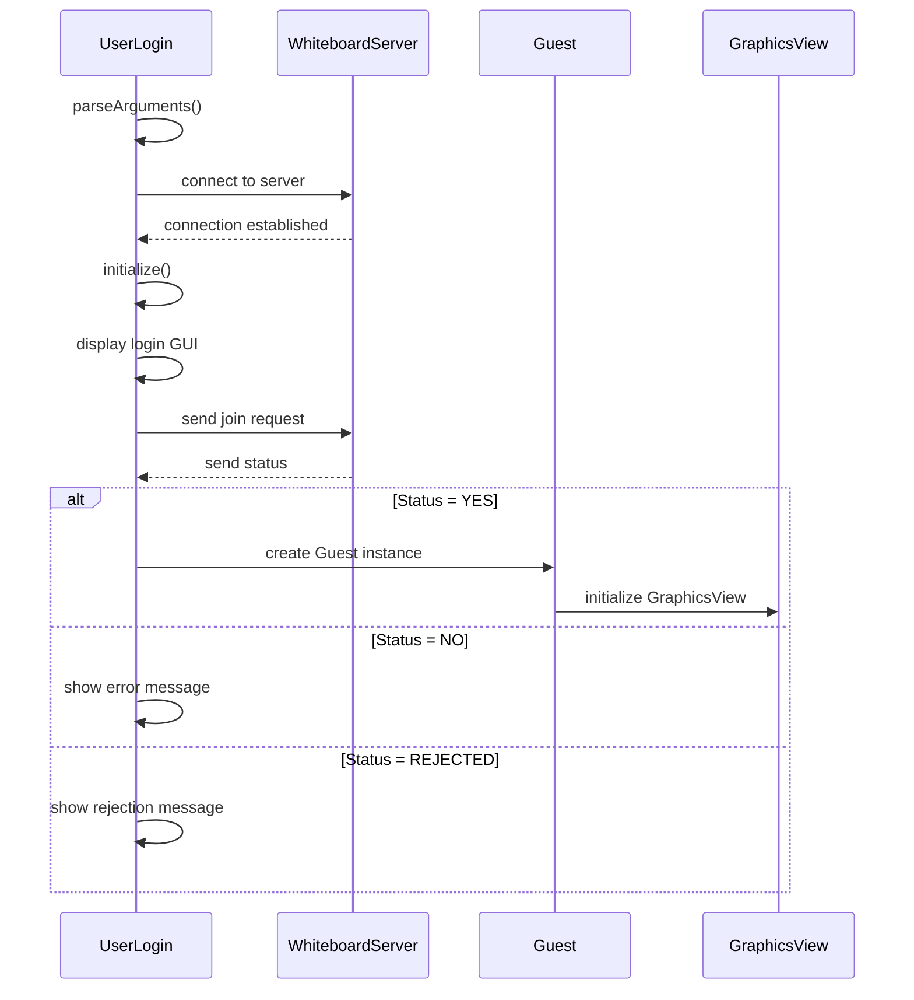
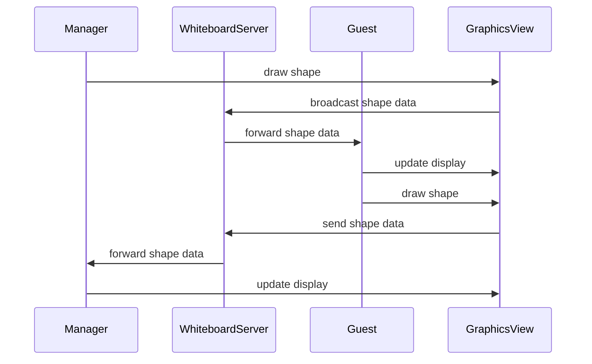
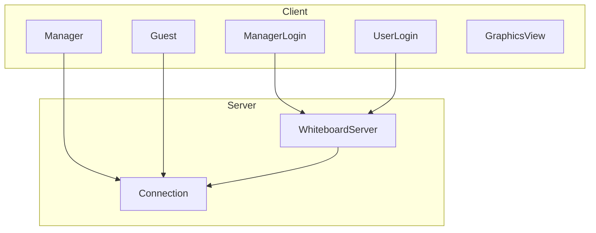

# Distributed Whiteboard System - UML Diagrams

## Class Diagram

## Sequence Diagrams

### Manager Login Flow

### User Login Flow

### Whiteboard Operation Flow

## Component Diagram

## Notes

1. **Class Relationships**:
   - ManagerLogin and UserLogin are entry points for manager and guest users
   - WhiteboardServer manages all connections and message broadcasting
   - Connection handles socket communication
   - Manager and Guest share similar structure but with different permissions
   - GraphicsView handles the drawing interface
   - Shape interface defines drawing behavior

2. **Key Interactions**:
   - Manager must start the server before guests can connect
   - All drawing operations are broadcasted to all connected clients
   - Server maintains the list of connected users
   - Connection status is managed through the Connection class

3. **Design Patterns Used**:
   - Observer Pattern: For handling drawing updates
   - Singleton Pattern: For server instance
   - Factory Pattern: For creating shapes
   - MVC Pattern: For separating UI and logic 